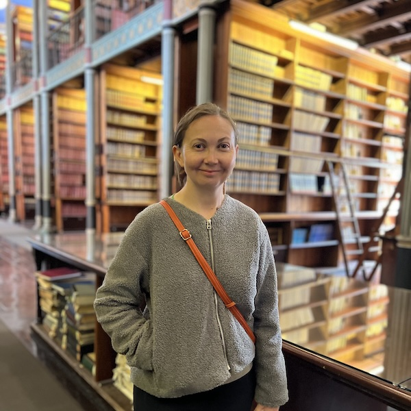

I am a seasoned researcher and writer based in Australia, with a particular interest in gory medical history and women who operate outside of the boundaries of their time. My academic research focused on ancient female healing networks and the nebulous world of women working together to protect themselves.

  
 
